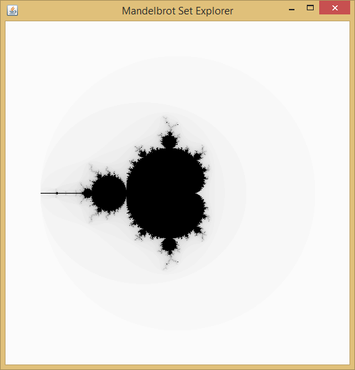
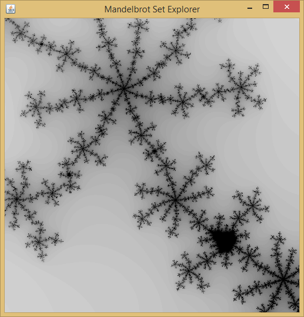

# Mandelbrot Set Explorer
A Java GUI for displaying the Mandelbrot set in grayscale. 

The program calculates the Mandelbrot set for a fixed number of iterations in a 500x500 pixel display.

  

And here is the result of zooming in.

  

## Usage
Use the mouse drag for navigating the display and the scroll wheel from the mouse for zooming in and out.

